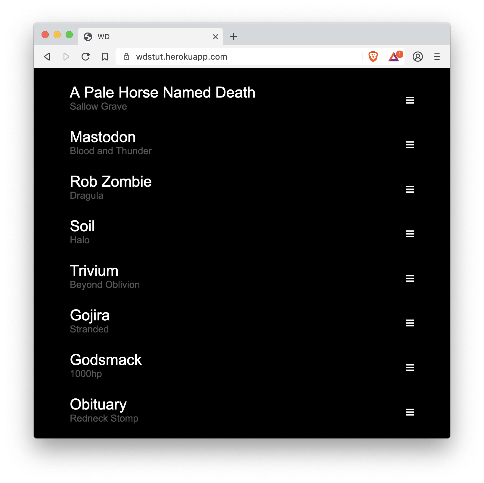
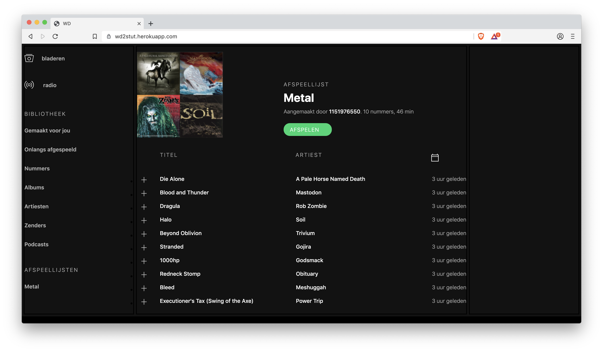
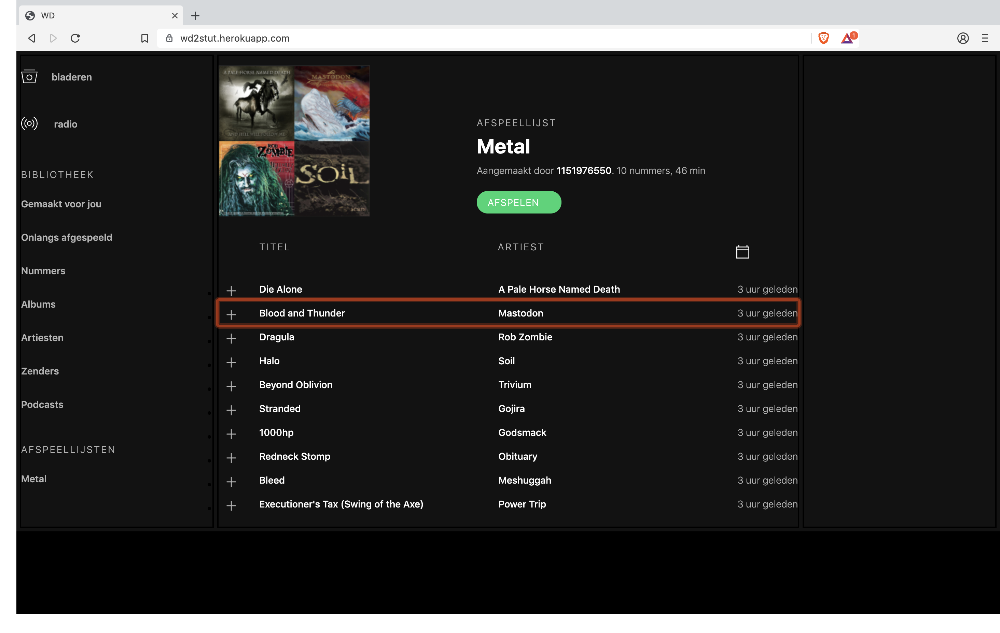
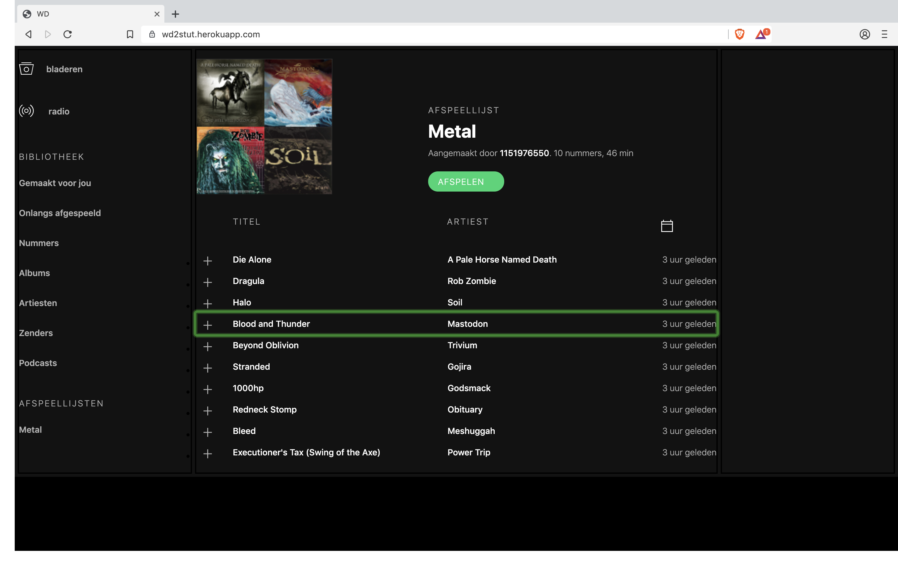

prototype: [https://wd2stut.herokuapp.com/](https://wd2stut.herokuapp.com/)

bekijk de code op: [branch week2](https://github.com/RobinStut/web-design-1819/tree/week2)

# Web Design @cmda-minor-web 1819
Werken met en voor echte mensen.

## Inleiding
> Marijn is motorisch gestoord. Hij gebruikt zijn computer dus anders dan wij. Hij heeft veel moeite met fijne motoriek. Hij gebruikt zijn toetsenbord om te navigeren, en in de Accessibility settings van zijn Mac heeft hij Sticky Keys aan staan.

### Wie is Marijn?
Marijn heeft een motorische handicap waardoor hij handelingen van zijn fijne motoriek niet onder controle heeft. Om een beeld te krijgen van hoe Marijn door het leven gaat, is er een video beschikbaar waar je een beeld kan krijgen van waar Marijn eigenlijk last van heeft. *Je kunt de video bekijken door op de afbeelding te klikken.*

### Een nuttig product voor Marijn

Een van de lastige dingen waar Marijn niet mee om kan gaan zijn *Drag and Drop* elementen. Wanneer je een lijstje wilt orderen zou dit voor hem een onmogelijke opdracht zijn. Marijn is een groot Metal fan, en hoe leuk zou het dan zijn dat hij zelf een Metal lijst zou kunnen samenstellen op spotify waar hij zijn eigen volgorde van zou kunnen bepalen.

### Prototype test 1

Na het samenstellen van een aantal Metal nummers ben ik begonnen met het maken van een Spotify lijst die gesorteerd kon worden met bepaalde toets aanslagen. Mijn aanname was dat omdat Marijn moeite heeft met specifieke taken, dat ik de raakvelden van de besturing heel groot moest trekken. Op deze mannier was mijn aanname dat Marijn gemakkelijker zou kunnen navigeren door het lijstje. Zodra er op __Tab__ geklikt werd, kwam er een focus op een element, deze focus kon je verplaatsen met behulp van het toetsenbord. Het vastpakken van een element zou moeten gebeuren met de spatietoets. Tijdens het testen op zijn computer bleek dat de __Tab__ toets uitgeschakeld staat in Safari. Dit zorgde ervoor dat mijn prototype niet getest kon worden op zijn browser. Achteraf bleek dat als het element een autofocus zou hebben, dat het wel gewerkt zou hebben.

Een ander prototype die ik had om te testen was het interface van Spotify. In de app van spotify is het lastig om te navigeren met behulp van __Tap__ of __W A S D__ toetsen. Door gebruik te maken van __Spacial Navigation__ wilde ik testen of het voor Marijn gemakkelijker werd om te navigeren. Alle functionaliteit van mijn eerste test was niet ingebouwd in dit prototype. Tijdens het testen vroeg Marijn zich af waarom ik gekozen had voor de toetsen __W A S D__, dit omdat het voor hem te nauwkeurige toetsen zijn die te dicht bij elkaar liggen. Na de eerste ontmoeting en het afronden van de testen ben ik gaan nadenken hoe ik de navigatie voor Marijn nog makkelijker en leuker kan maken.

### Iteratie 1

Na het testen van mijn prototype bedacht ik me het volgende. Doordat zijn motoriek erg grof is en specifieke handelingen veel inspanning vragen, ben ik gaan kijken naar een alternatieve navigatie methode. Doordat Marijn zijn wagen bestuurt met behulp van een __Joystick__ werd ik geinspireerd door zijn manier van navigeren. Vervolgens heb ik een __Joystick__ uitgezocht met robuuste knoppen, die Marijn zou kunnen gebruiken voor het navigeren. De __Joystick__ is bedoeld om te gamen op een android telefoon of Windows computer, waardoor ik op zoek moest gaan naar een omweg. Door de aplicatie [Joystick Mapper](https://joystickmapper.com/) aan te schaffen was het mogelijk om de keycodes te koppelen aan bestaande toetsen op een toetsenbord.

Nadat alles werkend gemaakt was met de __Joystick__ heb ik de twee prototypes samengevoegd tot 1 prototype. Dit vroeg veel energie aangezien beide functionaliteiten elkaar overschreven. Vervolgens heb ik de focuskleur aangepast zodat er op elke browser een groter contrast is, deze viel wat weg door de donkere achtergrond. Ook heb ik een autofocus toegevoegd waardoor er direct genavigeerd kon worden in het prototype.

### Prototype test 2

Tijdens het testen van de iteraties op het vorige prototype werd Marijn erg enthousiast van de Joystick. Het was even zoeken naar de juiste plek voor de joystick om deze te bedienen. Waar ik al bang voor was, was dat de __Joystick__ te ligt was waardoor het voor Marijn lastig wordt om de joystick op 1 vast punt te laten staan. Tijdens het testen hield ik daarom de controller op zijn plek. Het navigeren ging stukken beter dan ik had verwacht. Af en toe stootte Marijn te snel tegen de joystick aan, waardoor de focus buiten het canvas belandde omdat er meerdere toetsaanslagen plaats vonden. Ondanks dat wist Marijn mijn test goed te doorlopen en was het voor hem mogelijk bepaalde nummers op volgorde te sorteren. 

>De oranje focus geeft aan waar je heen genavigeerd bent

>De groene focus geeft aan dat het element vastgepakt is, deze is nu te verplaatsen m.b.v de Joystick

### Iteratie 2

Na het afronden van de 2de testronde heb ik een __Timeout__ toegevoegd aan het prototype van 0.3 seconden. Hierdoor wordt er voorkomen dat onbedoelde dubbele aanslagen verkomen worden. 

### Dingen die ik nog had willen toevoegen:

- [ ] De focus willen locken tot een bepaald gebied, waardoor deze niet kan verdwijnen.
- [ ] Wanneer er naar links wordt genavigeerd in het meest linker kolom, de focus verplaatsen naar de meest rechter kolom.
- [ ] Een virtuele Joystick aangeroepen kan worden met een simpele toets, waarmee je vervolgens op een grappige wijze gebruik kan maken van de Joystick zonder een fysieke Joystick